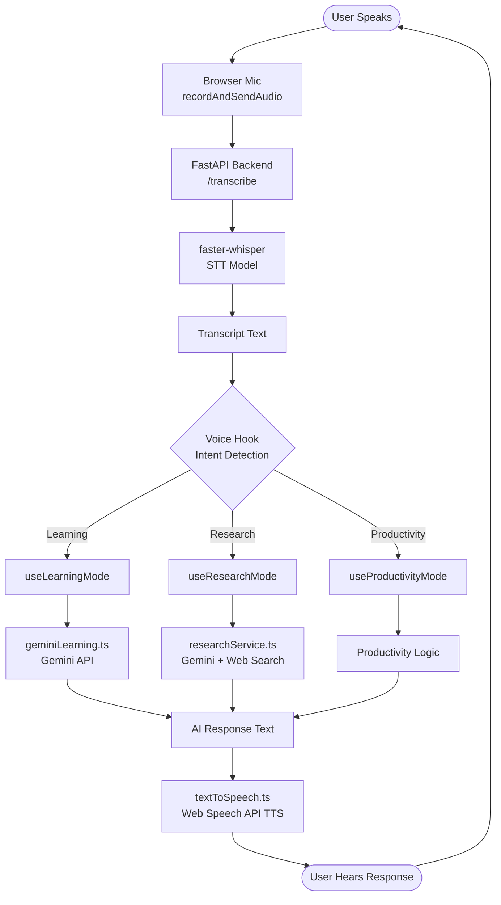

<div align="center">
EchoEd
Learning Assistant for Visually Impaired
A fully voice-navigated AI platform that lets blind and visually impaired users learn, research, and stay productive — entirely through speech.
---


</div>
---
Table of Contents
Product Overview
UN SDG Global Impact
Features
System Architecture
Tech Stack
Installation Guide
Voice Command Reference
Project Structure
SDLC Journey
---
Product Overview
EchoEd is a voice-first AI learning assistant built for blind and visually impaired individuals. It requires no screen reading, no keyboard navigation, and no button presses. Every interaction — from selecting a mode to answering a quiz question to bookmarking a research paper — is driven entirely by the user's spoken voice.
The platform is built around three core modes:
Learning Mode — Ask EchoEd to explain any topic, test yourself with AI-generated recall questions, or teach a concept back and receive personalised feedback. All powered by Gemini AI, all navigated by voice.
Research Mode — Speak a research topic and EchoEd searches Google Scholar and IEEE for recent papers, reads them aloud sentence-by-sentence, and lets you bookmark key sentences by saying "highlight".
Productivity Mode — Manage your day through voice: read daily plans, start focus timers, set reminders, schedule revision sessions, and track learning performance over time.
EchoEd is designed for two overlapping user groups: fully blind users who rely entirely on audio output, and partially sighted users who benefit from the high-contrast, large-text visual interface that mirrors what the voice is saying.
---
UN SDG Global Impact
Goal	Alignment
SDG 3 — Good Health & Well-Being	Promotes mental well-being and cognitive independence for visually impaired individuals by reducing reliance on sighted assistance for everyday learning tasks
SDG 4 — Quality Education	Provides equitable access to AI-powered education tools for a population historically excluded from standard EdTech platforms. Voice-driven quizzing, explanation, and research tools democratise self-directed learning
SDG 10 — Reduced Inequalities	Directly addresses the digital accessibility gap. Blind users gain access to the same quality of AI learning tools available to sighted users, with no compromise in capability
> An estimated **253 million people** worldwide live with vision impairment (WHO, 2023). EchoEd is built for them.
---
Features
🎙️ Learning Mode
Explanation Mode — Say any topic; Gemini generates a clear 3–4 sentence spoken explanation
Active Recall — AI generates 3 questions on your topic; answer by voice and get immediate spoken feedback per answer
Teach Me Back — Explain a topic aloud; AI evaluates your explanation and gives warm, specific feedback
🔬 Research Mode
Searches Google Scholar and IEEE for recent papers via Gemini web search
Reads paper title, authors, year, journal aloud for each result
Select a paper by saying "paper one / two / three"
Reads abstract, introduction, and conclusion sentence-by-sentence with progress tracking
Say "highlight" at any point to bookmark the currently-spoken sentence
Review all saved highlights on demand
⚡ Productivity Mode
Daily Plan Reader — Voice navigation through scheduled tasks; say "next", "repeat", "go back"
Focus Timer — Speak a duration to start a timer; voice alert on completion
Reminders — Dictate task and time; assistant reads back for confirmation before saving
Revision Scheduler — Speak a topic and frequency; AI schedules spaced revision sessions
Performance Tracker — Tracks quiz scores and teach-back ratings; say "how am I doing" for a spoken summary
🖥️ Accessibility-First UI
High-contrast black and gold design for partial sight visibility
All text at minimum 20px
Live status indicator: Speaking / Listening / Thinking / Ready
Visual feedback mirrors exactly what the voice is saying
---
System Architecture
Voice Interaction Flow

System Block Diagram
```mermaid
block-beta
    columns 3

    block:Frontend:3
        columns 3
        A["App.tsx\nScreen Router"]
        B["ModeSelection.tsx"]
        C["StartScreen.tsx"]
        D["LearningMode.tsx\n(UI only)"]
        E["ResearchMode.tsx\n(UI only)"]
        F["ProductivityMode.tsx\n(UI only)"]
    end

    block:Hooks:3
        columns 3
        G["useLearningMode.ts\nVoice Flow + State"]
        H["useResearchMode.ts\nVoice Flow + State"]
        I["useProductivityMode.ts\nVoice Flow + State"]
    end

    block:Services:3
        columns 3
        J["textToSpeech.ts\nPromise-based TTS"]
        K["speechToText.ts\n4s Mic Capture"]
        L["geminiLearning.ts\nAI Prompts"]
        M["researchService.ts\nPaper Search"]
        N["voiceState.ts"]
        O[""]
    end

    block:Backend:2
        P["FastAPI\nmain.py"]
        Q["faster-whisper\nWhisper STT"]
    end

    block:External:1
        R["Gemini API\ngoogle AI"]
    end

    D --> G
    E --> H
    F --> I
    G --> J
    G --> K
    G --> L
    H --> J
    H --> K
    H --> M
    K --> P
    P --> Q
    L --> R
    M --> R
```
Request Lifecycle
```
User speaks
    │
    ▼
recordAndSendAudio()          ← 4 second mic capture in browser
    │
    ▼
POST /transcribe               ← FastAPI receives audio blob
    │
    ▼
faster-whisper model           ← Transcribes audio to text locally
    │
    ▼
{ "text": "explain photosynthesis" }
    │
    ▼
Intent detection in hook       ← toLowerCase + keyword matching
    │
    ▼
Gemini API call                ← Structured prompt, plain text response
    │
    ▼
speak(response)                ← Promise-based TTS, resolves on onend
    │
    ▼
Next listen() call             ← Mic opens only AFTER speech finishes
```
---
Tech Stack
Layer	Technology	Purpose
Frontend Framework	React 18 + TypeScript	Component architecture, hooks, strict typing
Styling	Tailwind CSS	High-contrast accessible UI
Text-to-Speech	Web Speech API (`SpeechSynthesisUtterance`)	Browser-native TTS, Promise-wrapped
Speech-to-Text	`MediaRecorder` API + FastAPI backend	4s audio capture, sent to Whisper
STT Model	`faster-whisper` (Python)	Local Whisper transcription
AI Engine	Google Gemini 2.0 Flash	Explanations, quiz generation, evaluation, web search
Backend	FastAPI + Uvicorn	`/transcribe` endpoint for audio processing
Icons	Lucide React	Accessible icon set
---
Installation Guide
Prerequisites
Node.js 18+
Python 3.9+
A Gemini API key — get one free at ai.google.dev
A microphone connected to your machine
---
Step 1 — Clone the Repository
```bash
git clone <your-repo-url>
cd EPL
```
---
Step 2 — Set Up the Frontend
```bash
cd EPL
npm install
```
Add your Gemini API key. Open `src/services/geminiLearning.ts` and replace:
```ts
const GEMINI_API_KEY = "YOUR_GEMINI_API_KEY";
```
---
Step 3 — Set Up the Backend
Open a new terminal window:
```bash
cd EPL/backend
```
Create and activate a virtual environment:
```bash
# macOS / Linux
python3 -m venv venv
source venv/bin/activate

# Windows
python -m venv venv
venv\Scripts\activate
```
Install Python dependencies:
```bash
pip install -r requirements.txt
```
> **Note:** `faster-whisper` will download the Whisper model on first run (~150MB for the base model). Ensure you have an internet connection for the first launch.
---
Step 4 — Run the Backend
```bash
cd EPL/backend
uvicorn main:app --reload --host 127.0.0.1 --port 8000
```
You should see:
```
INFO:     Uvicorn running on http://127.0.0.1:8000 (Press CTRL+C to quit)
INFO:     Application startup complete.
```
---
Step 5 — Run the Frontend
In your original terminal:
```bash
cd EPL
npm run dev
```
Open your browser and go to:
```
http://localhost:5173
```
---
Step 6 — Allow Microphone Access
When the app loads, your browser will ask for microphone permission. Click Allow. EchoEd cannot function without microphone access.
---
Troubleshooting
Problem	Fix
`Cannot connect to http://127.0.0.1:8000`	Make sure the backend is running in a separate terminal
Microphone not working	Check browser permissions — go to site settings and allow microphone
Whisper model slow on first run	Normal — model is downloading. Subsequent runs are fast
`ModuleNotFoundError: faster_whisper`	Run `pip install -r requirements.txt` inside the activated venv
Gemini returns no results	Check your API key is correctly set in `geminiLearning.ts`
TTS not speaking	Make sure your system volume is on and browser is not muted
---
Voice Command Reference
Mode Selection
Say	Action
`"productivity"` or `"one"`	Open Productivity Mode
`"learning"` or `"two"`	Open Learning Mode
`"research"` or `"three"`	Open Research Mode
Learning Mode
Say	Action
`"explanation"`	Enter Explanation Mode
`"recall"`	Enter Active Recall
`"teach me back"`	Enter Teach Me Back
`"again"`	Replay last explanation
`"new topic"`	Start with a different topic
`"menu"`	Return to Learning Mode menu
Research Mode
Say	Action
Any topic name	Search for papers on that topic
`"paper one / two / three"`	Select and read a paper
`"highlight"`	Save currently-spoken sentence
`"stop reading"`	Stop paper playback
`"my highlights"`	Hear all saved highlights
`"new topic"`	Search a different topic
`"go back"`	Return to mode selection
Productivity Mode
Say	Action
`"read my plan"`	Hear today's scheduled tasks
`"start focus timer"` + duration	Start a countdown timer
`"set a reminder"`	Dictate a reminder with time
`"schedule revision"` + topic	Schedule spaced revision sessions
`"how am I doing"`	Hear learning performance summary
---
Project Structure
```
EPL/
├── backend/
│   ├── main.py                    # FastAPI app — /transcribe endpoint
│   ├── requirements.txt           # Python dependencies
│   └── __pycache__/
│
└── EPL/                           # React frontend
    └── src/
        ├── app/
        │   └── components/
        │       ├── shared/
        │       │   └── Voiceui.tsx          # StatusBar component
        │       ├── modes/
        │       │   ├── ExplanationMode.tsx
        │       │   ├── ActiveRecallMode.tsx
        │       │   └── TeachMeBackMode.tsx
        │       ├── LearningMode.tsx
        │       ├── ResearchMode.tsx
        │       ├── ProductivityMode.tsx
        │       ├── ModeSelection.tsx
        │       └── StartScreen.tsx
        ├── hooks/
        │   ├── useLearningMode.ts           # Learning voice flow + state
        │   └── useResearchMode.ts           # Research voice flow + state
        ├── services/
        │   ├── speech/
        │   │   ├── textToSpeech.ts          # Promise-based TTS
        │   │   ├── speechToText.ts          # 4s mic capture → backend
        │   │   └── voiceState.ts
        │   ├── geminiLearning.ts            # Gemini AI prompts
        │   └── researchService.ts           # Paper search service
        ├── styles/
        │   ├── fonts.css
        │   ├── globals.css
        │   ├── index.css
        │   └── tailwind.css
        ├── App.tsx                          # Screen router
        └── main.tsx
```
---
SDLC Journey
Week-by-Week Build
Week	Focus	Key Output
Week 1	Requirements & Design	User research, architecture design, voice interaction model defined
Week 2	Core Build	Learning Mode + Research Mode implemented. Service/Hook/UI architecture established
Week 3	Resilience & Edge Cases	TTS/STT race condition fixed, empty transcript retries, API error handling, isRunning guards
Week 4	Refactoring & Polish	Spaghetti components split into clean layers, import paths audited, Productivity Mode added
Key Engineering Decisions
1. Promise-based TTS
The most critical architectural decision. `speak()` was originally `void` — microphone opened while assistant was still speaking, capturing TTS audio as user input. Wrapping in a Promise that resolves on `utterance.onend` fixed the entire voice loop.
2. Service / Hook / UI separation
Every mode follows the same pattern: services handle external calls, hooks own all state and async voice logic, UI components are visual feedback only. This made every bug easy to isolate and fix.
3. Parallel highlight listener
During paper reading, a continuous Web Speech API listener runs in parallel to catch "highlight" commands in real time — while `recordAndSendAudio()` (sequential, 4s capture) handles all other navigation. This is the only justified use of continuous speech recognition in the codebase.
4. Voice-only navigation
No button presses required for any navigational action. UI buttons exist only for partially sighted users who can see the screen — all actions complete without them.
---
<div align="center">
Built with ❤️ by Team EchoEd
"Technology should work for everyone — not just those who can see the screen."
</div>
